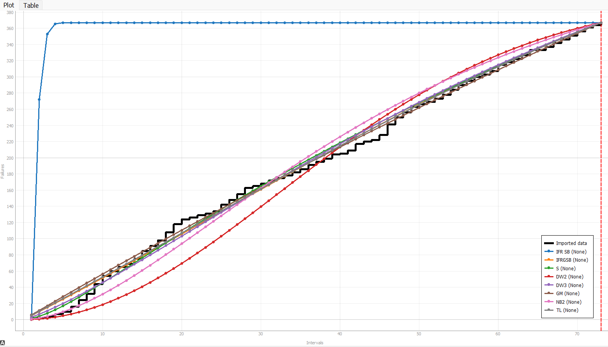
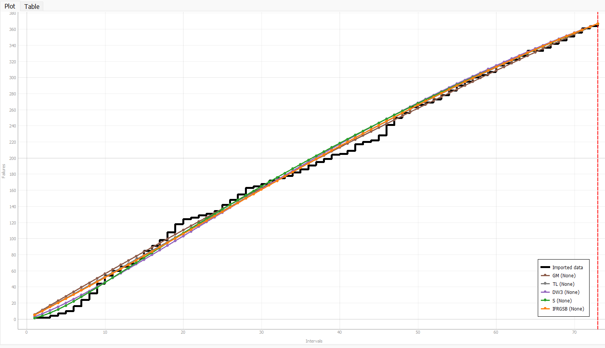
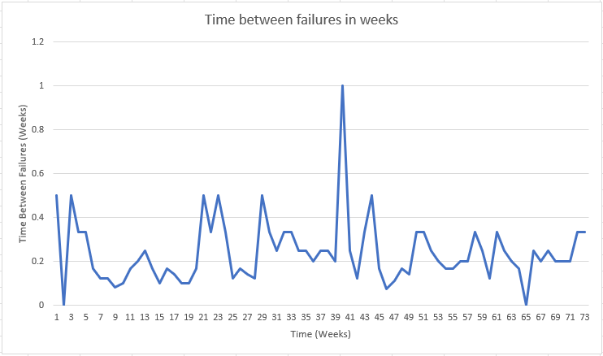
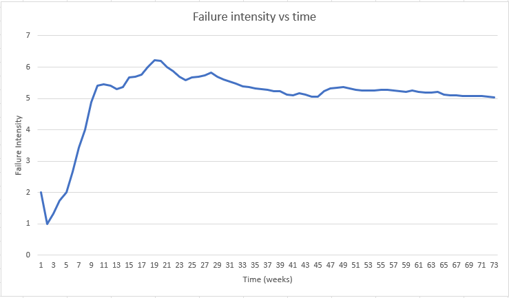
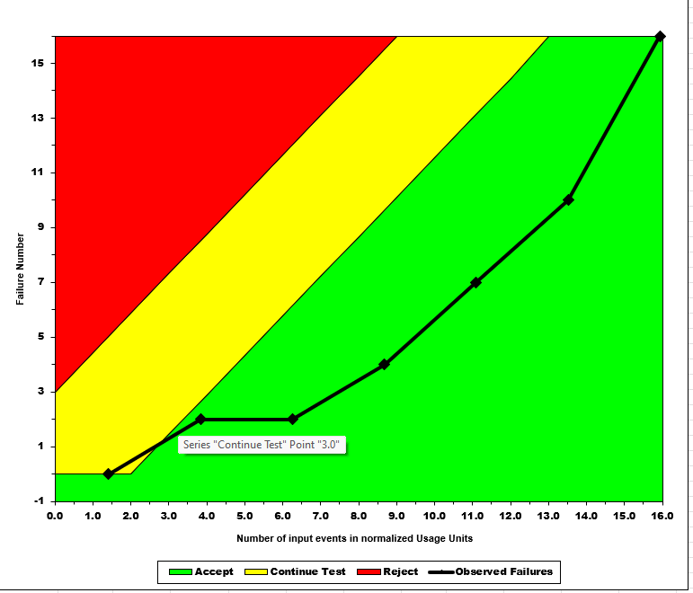
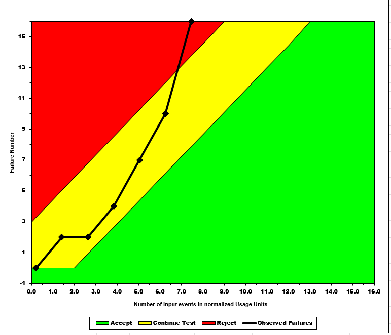
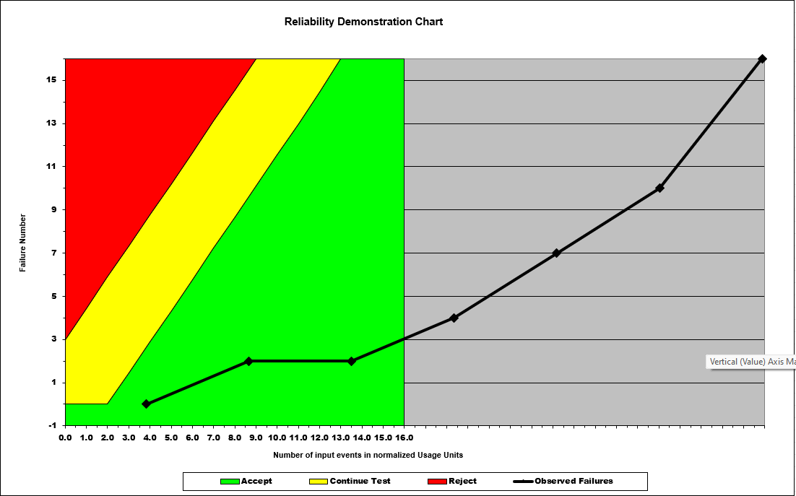

**SENG 438- Software Testing, Reliability, and Quality**

**Lab. Report \#5 – Software Reliability Assessment**

| Group \#:       |   |
|-----------------|---|
| Student Names:  | Hamza Niaz |
|                 | Bilal Pasha |
|                 | Yousef Hammad |
|                 | Issam Akthar |

# Introduction

In this lab assignment, students were introduced to the fundamental concepts of reliability assessment and failure data analysis in software testing. The goal was to understand the importance of tools such as C-SFRAT and the Reliability Demonstration Chart with the help of Excel and to explore the reliability growth testing that helps identify the changes in the product over time. Additionally, the lab introduced the concept of failure data analysis and its significance in preventing future failures. The lab also focused on the use of two new software systems, C-SFRAT and RDC-11, for software failure data analysis and provided a comparison of their results. Through these activities, students gained a better understanding of the role of reliability testing in software development.

# Assessment Using Reliability Growth Testing 

For this part of the lab, we use the C-SFRAT software. C-SFRAT stands for "Software Failure Reporting and Analysis Tool," and it is a software system used for analyzing and reporting software failures. C-SFRAT is designed to help identify, document, track, and manage software issues and defects that arise during software development and testing.

C-SFRAT works by allowing software testers to enter information about each software failure or issue that occurs, including details such as the date, time, location, and severity of the problem. This information is then stored in a centralized database, which allows developers and testers to analyze the data to identify patterns and trends in software failures.

C-SFRAT also provides reporting and analysis tools that allow testers to generate charts and graphs to visualize the data and identify potential areas for improvement in the software development process. By using C-SFRAT, software development teams can more effectively identify and address software defects and issues, leading to more reliable and higher quality software products.

The image below shows all the models for this set of failure data.

The image below shows all the best models that the predicted the failure rate.

The system's data will be studied up to and including error 16, which ensures the removal of the decline after this peak and enables better consistency in the data in subsequent tests, as demonstrated by the results, which indicate that the failure intensity peaked at about the 16th error. Given that the duration between failures is first quite long but then starts to increase again at roughly 19 seconds, the failure rate also played a role in how specific data points were removed from subsequent analyses. This demonstrated that if certain data were not removed from the calculations, expanding the inclusiveness of the tests beyond 19 could result in inconsistent data. Although reliability can be calculated, this is undesirable since reliability calculations need to know the number of components in the system being tested, including both the total number of components and the number that failed. Since they were not included in the software documentation or failure reports, a reliability graph could not be produced. Without these, it is impossible to determine the software's dependability in the given situation. This method's capacity to use diverse graph data to choose the right data set and examine the system in greater detail makes it much simpler to ascertain the system's genuine reliability. The need for several graph types to thoroughly evaluate the data and make sure it is accurate, high-quality, and consistent enough to test is a problem. When they are taken into account, the software failure analysis approach may be demonstrated to be helpful when dealing with numerous considerations and circumstances that may be causing the reliability, or lack thereof.

Below are some graphs that helped us visualize the failure intensity and time intervals that they were happeing at.

# Assessment Using Reliability Demonstration Chart 

In this analysis, three plots were created to visualize the reliability of the system using the provided failure data as input. The first plot shows the MTTFmin, which suggests an acceptable trend for the FIO without heavily diving into the reject range. The second plot shows the half MTTF, where the parameters were adjusted accordingly, resulting in a trend that dives more within the reject range. The third plot shows the twice MTTF, where the parameters were adjusted for twice the initial MTTF, resulting in a trend that dives more within the acceptable range. The changes made in the plots correspond to the number of acceptable failures, which affects the data points in the accept or reject region.

# Comparison of Results

# Discussion on Similarity and Differences of the Two Techniques

# How the team work/effort was divided and managed

# 

# Difficulties encountered, challenges overcome, and lessons learned

# Comments/feedback on the lab itself
